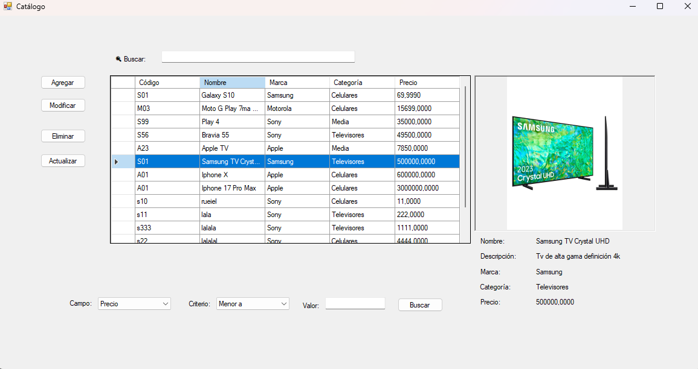

# 📦 Sistema de Gestión de Productos

## 📷 Capturas de pantalla

Aplicación de escritorio desarrollada en .NET para la gestión integral de productos, que permite administrar artículos mediante operaciones de alta, modificación, eliminación, visualización detallada y filtrado dinámico contra base de datos.

El sistema implementa una arquitectura en capas y utiliza acceso a datos mediante ADO.NET, con persistencia en base de datos SQL Server Express.

---

## 🚀 Funcionalidades principales

- ✔ Alta de productos  
- ✔ Modificación de artículos existentes  
- ✔ Eliminación de registros  
- ✔ Visualización de detalles completos  
- ✔ Filtros dinámicos y búsquedas avanzadas  
- ✔ Persistencia de datos en base de datos SQL  
- ✔ Validaciones de integridad de datos  

---

## 🏗 Arquitectura

El proyecto está estructurado siguiendo el patrón de **Arquitectura en Capas**:

- **Presentación (UI)**  
- **Negocio (Lógica de negocio)**  
- **Datos (Acceso a datos mediante ADO.NET)**  
- **Base de datos (SQL Server Express)**  

Esta separación permite:

- Mejor mantenibilidad  
- Escalabilidad  
- Separación clara de responsabilidades  
- Código más limpio y organizado  

---

## 🛠 Tecnologías utilizadas

- .NET  
- C#  
- ADO.NET  
- SQL Server Express  
- Arquitectura en Capas  
- Git (flujo de trabajo con ramas feature)  

---

## 🗄 Base de datos

El sistema utiliza **SQL Server Express** como motor de base de datos.  
La persistencia se realiza mediante consultas parametrizadas utilizando ADO.NET, garantizando seguridad y control en el acceso a datos.

---

## 🎯 Objetivo del proyecto

Este proyecto fue desarrollado como práctica de consolidación de conocimientos en:

- Acceso a datos con ADO.NET  
- Diseño de arquitectura en capas  
- Manejo de base de datos relacional  
- Buenas prácticas de desarrollo  
- Flujo de trabajo con Git y control de versiones  

---

## 📌 Estado del proyecto

Proyecto finalizado. 
Se implementaron las funcionalidades utilizando un flujo de trabajo basado en ramas `feature` para mantener la estabilidad de la rama principal.
